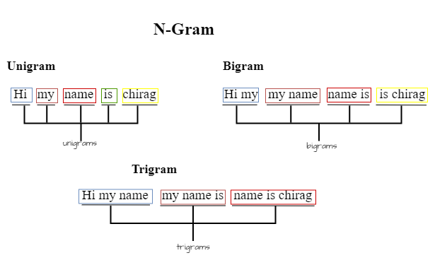

# N-Gram Language Model: Unigrams

Welcome to the N-Gram Language Model repository! This project explores the foundational concepts of N-gram models, specifically focusing on unigrams, to understand how language models estimate word probabilities in a sentence.

## What is an N-Gram?

An N-gram is a sequence of 'n' words. For example:

- **Unigram**: "hello" (n=1)
- **Bigram**: "hello world" (n=2)
- **Trigram**: "hello world python" (n=3)



In this project, we emphasize unigrams as the simplest form of N-gram language models.

## What is a Unigram?

A unigram model estimates the probability of each word in a sentence based on its frequency in the training text. The model assumes:

1. **Word Independence**: Each word's probability is independent of the preceding words.
2. **Frequency-Based Estimation**: The probability of a word depends on its frequency relative to the total words in the training text.

For example, given the sentence "I have a car [END]," the goal is to estimate the probability of each word based on the preceding words.

\[ P(dream) = \frac{n(dream)}{N} \]

Where:

- \( n(dream) \) is the number of times "dream" appears in the training text.
- \( N \) is the total number of words in the training text.

After calculating unigram probabilities, you can apply them to compute sentence probabilities.

## Getting Started

To explore the unigram model and its applications:

1. Clone the repository:

   ```bash
   git clone https://github.com/ChiragB254/n-gram.git
   ```

2. Open the Jupyter notebook or Python script in the repository to see the unigram model in action.

## Resources

For a more in-depth explanation of N-gram language models, check out [this insightful Medium article](https://medium.com/mti-technology/n-gram-language-model-b7c2fc322799) by Khanh Nguyen.

## Connect with Me

- **LinkedIn**: [Chirag B.](https://www.linkedin.com/in/chiragb254)
- **Email**: devchirag27@gmail.com

Contributions are welcome! Whether you want to suggest improvements, fix bugs, or add more examples, your contributions will help enhance this project.

Let's dive into the world of N-grams and unigrams together! 🚀✨
